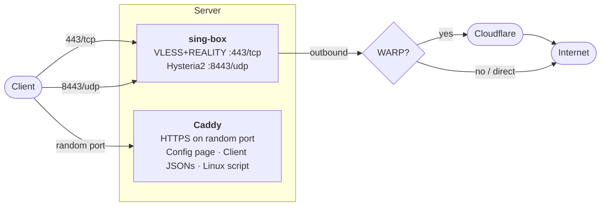

# singbox-server

> **[Читать на русском (README.ru.md)](README.ru.md)**

One-click VPN server: **VLESS+REALITY** + **Hysteria2** with a web-based config page.

Deploy on any Ubuntu/Debian or RHEL/CentOS/Fedora server and get a shareable link that auto-configures VPN on your phone.

## Quick Start

```bash
curl -sSL https://raw.githubusercontent.com/thezillo/singbox-server/main/install.sh | sudo bash
```

That's it. Open the printed link on your phone.

### With WARP (recommended for privacy)

```bash
curl -sSL https://raw.githubusercontent.com/thezillo/singbox-server/main/install.sh | sudo bash -s -- --warp
```

### With WARP+ (faster)

```bash
curl -sSL https://raw.githubusercontent.com/thezillo/singbox-server/main/install.sh \
  | sudo WARP_LICENSE_KEY=xxxxxxxx-xxxxxxxx-xxxxxxxx bash -s -- --warp
```

## How It Works


## What You Get

- **Smart routing** — local traffic stays local, only foreign traffic goes through the server. No need to toggle VPN on and off
- **VLESS+REALITY** (port 443/tcp) — undetectable protocol that looks like regular HTTPS to Google
- **Hysteria2** (port 8443/udp) — QUIC-based, optimized for speed on lossy networks
- **Web config page** — share a link, phone auto-configures via the Sing-Box app
- **Client configs** for iOS, Android, Linux, macOS, and Windows

## Options

### Command-line Flags

| Flag | Description |
|------|-------------|
| `--warp` | Enable Cloudflare WARP outbound (hides server IP from destinations) |
| `--country XX` | Set bypass country code, e.g. `--country ir` (default: `ru`) |
| `--non-interactive` | Skip all prompts (auto-applied when piped) |
| `--dry-run` | Preview what would be done, no changes |
| `--update` | Pull latest Docker images and restart services |
| `--uninstall` | Remove installation, containers, firewall rules |
| `--help` | Show usage |

### Environment Variables

| Variable | Default | Description |
|----------|---------|-------------|
| `INSTALL_DIR` | `/opt/sing-box` | Installation directory |
| `SING_BOX_VERSION` | `v1.11.4` | sing-box Docker image tag |
| `CADDY_VERSION` | `2.9` | Caddy Docker image tag |
| `WARP_LICENSE_KEY` | _(none)_ | WARP+ license key (implies `--warp`) |
| `NON_INTERACTIVE` | `false` | Skip all prompts |

## WARP (Recommended)

By default, traffic exits directly from your server's IP. With `--warp`, all VPN traffic is routed through Cloudflare's network first:

```
Client → Your Server → Cloudflare WARP → Internet
```

**Why use WARP:**
- Destination sites see Cloudflare's IP, not your server's
- Reduces risk of your server IP being blocked
- Access to Cloudflare-optimized routes

**Free WARP vs WARP+:**
- **Free WARP** — works fine, standard Cloudflare routing
- **WARP+** — uses Cloudflare's premium Argo network for lower latency. Get a key from the 1.1.1.1 mobile app (Settings → Account → Key)

## Clients

| Platform | App | Setup |
|----------|-----|-------|
| **iOS / Mac / Apple TV** | [Sing-Box VT](https://apps.apple.com/app/sing-box-vt/id6673731168) | Open config link → Add profile |
| **Windows** | [Sing-Box GUI](https://github.com/GUI-for-Cores/GUI.for.SingBox/releases/tag/v1.11.0) | Download → Import config |
| **Android** | [Sing-Box](https://play.google.com/store/apps/details?id=io.nekohasekai.sfa) | Open config link → Add profile |
| **Linux** | Built-in installer | `curl -sSL <linux-script-url> \| sudo bash` |

## Architecture



## Security

- **Secret path** — config page URL contains a 32-character hex token (2¹²⁸ combinations). No token = HTTP 404.
- **File permissions** — credentials stored with `600`, `umask 077` enforced during deployment.
- **Security headers** — `X-Content-Type-Options`, `X-Frame-Options`, `X-XSS-Protection`, `Referrer-Policy`.
- **Random port** — Caddy HTTPS port is randomized (10000–60000) to avoid scanning.
- **Log masking** — secrets are truncated in logs (first 8 chars only).
- **Idempotent** — re-running preserves existing credentials.

## Managing

```bash
# View logs
cd /opt/sing-box && docker compose logs -f

# Restart services
cd /opt/sing-box && docker compose restart

# Update Docker images
sudo ./deploy.sh --update

# Uninstall everything
sudo ./deploy.sh --uninstall
```

## Ports

| Port | Protocol | Service | Required |
|------|----------|---------|----------|
| 443 | TCP | VLESS+REALITY | Yes |
| 8443 | UDP | Hysteria2 | Yes |
| 80 | TCP | ACME (Let's Encrypt) | Yes |
| _random_ | TCP | Caddy HTTPS (config page) | Yes |

The deployment script will detect UFW or firewalld and offer to open these ports automatically.

## Local Testing

For local client testing (macOS/Linux):

```bash
cp clients/default.template.json config.json
# Edit config.json with your server's credentials
./run.sh
```

## License

MIT
