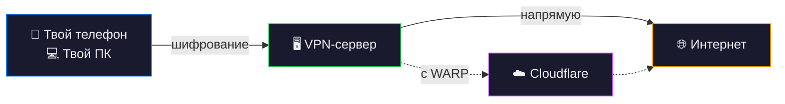
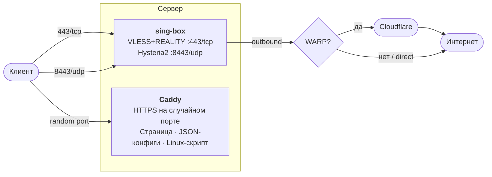

# singbox-server

VPN-сервер в одну команду: **VLESS+REALITY** + **Hysteria2** с веб-страницей для настройки клиентов.

Разверни на любом Ubuntu/Debian или RHEL/CentOS/Fedora сервере и получи ссылку, по которой VPN настроится на телефоне автоматически.

## Быстрый старт

```bash
curl -sSL https://raw.githubusercontent.com/thezillo/singbox-server/main/install.sh | sudo bash
```

Готово. Открой напечатанную ссылку на телефоне.

### С WARP (рекомендуется)

```bash
curl -sSL https://raw.githubusercontent.com/thezillo/singbox-server/main/install.sh | sudo bash -s -- --warp
```

### С WARP+ (быстрее)

```bash
curl -sSL https://raw.githubusercontent.com/thezillo/singbox-server/main/install.sh \
  | sudo WARP_LICENSE_KEY=xxxxxxxx-xxxxxxxx-xxxxxxxx bash -s -- --warp
```

## Как это работает



## Что получаешь

- **Умный роутинг** — локальный трафик остаётся локальным, через сервер идёт только зарубежный. Не нужно включать и выключать VPN
- **VLESS+REALITY** (порт 443/tcp) — неопределяемый протокол, выглядит как обычный HTTPS к Google
- **Hysteria2** (порт 8443/udp) — на базе QUIC, оптимизирован для скорости на нестабильных сетях
- **Веб-страница настройки** — поделись ссылкой, телефон настроится через приложение Sing-Box
- **Конфиги клиентов** для iOS, Android, Linux, macOS и Windows

## Параметры

### Флаги командной строки

| Флаг | Описание |
|------|----------|
| `--warp` | Включить Cloudflare WARP (скрывает IP сервера от сайтов) |
| `--country XX` | Код страны для обхода, например `--country ir` (по умолчанию: `ru`) |
| `--non-interactive` | Пропустить все вопросы (автоматически при pipe) |
| `--dry-run` | Показать что будет сделано, без изменений |
| `--update` | Обновить Docker-образы и перезапустить |
| `--uninstall` | Удалить: контейнеры, файлы, правила фаервола |
| `--help` | Показать справку |

### Переменные окружения

| Переменная | По умолчанию | Описание |
|------------|-------------|----------|
| `INSTALL_DIR` | `/opt/sing-box` | Директория установки |
| `SING_BOX_VERSION` | `v1.11.4` | Тег Docker-образа sing-box |
| `CADDY_VERSION` | `2.9` | Тег Docker-образа Caddy |
| `WARP_LICENSE_KEY` | _(нет)_ | Ключ WARP+ (включает `--warp`) |
| `NON_INTERACTIVE` | `false` | Пропустить все вопросы |

## WARP (рекомендуется)

По умолчанию трафик выходит напрямую с IP сервера. С `--warp` весь VPN-трафик идёт через сеть Cloudflare:

```
Клиент → Твой сервер → Cloudflare WARP → Интернет
```

**Зачем WARP:**
- Сайты видят IP Cloudflare, а не твоего сервера
- Меньше риск блокировки IP сервера
- Оптимизированные маршруты Cloudflare

**Free WARP vs WARP+:**
- **Free WARP** — работает нормально, стандартная маршрутизация
- **WARP+** — премиальная сеть Argo, ниже задержки. Ключ можно получить в приложении 1.1.1.1 (Настройки → Аккаунт → Ключ)

## Клиенты

| Платформа | Приложение | Настройка |
|-----------|-----------|-----------|
| **iOS / Mac / Apple TV** | [Sing-Box VT](https://apps.apple.com/app/sing-box-vt/id6673731168) | Открой ссылку → профиль добавится |
| **Windows** | [Sing-Box GUI](https://github.com/GUI-for-Cores/GUI.for.SingBox/releases/tag/v1.11.0) | Скачай → импортируй конфиг |
| **Android** | [Sing-Box](https://play.google.com/store/apps/details?id=io.nekohasekai.sfa) | Открой ссылку → профиль добавится |
| **Linux** | Встроенный скрипт | `curl -sSL <url-скрипта> \| sudo bash` |

## Архитектура



## Безопасность

- **Секретный путь** — URL содержит 32-символьный hex-токен (2¹²⁸ комбинаций). Без токена — HTTP 404.
- **Права файлов** — креденшелы хранятся с правами `600`, `umask 077` при деплое.
- **Заголовки безопасности** — `X-Content-Type-Options`, `X-Frame-Options`, `X-XSS-Protection`, `Referrer-Policy`.
- **Случайный порт** — HTTPS-порт Caddy рандомизируется (10000–60000).
- **Маскировка логов** — секреты обрезаются (первые 8 символов).
- **Идемпотентность** — повторный запуск сохраняет существующие креденшелы.

## Управление

```bash
# Логи
cd /opt/sing-box && docker compose logs -f

# Перезапуск
cd /opt/sing-box && docker compose restart

# Обновить Docker-образы
sudo ./deploy.sh --update

# Удалить всё
sudo ./deploy.sh --uninstall
```

## Порты

| Порт | Протокол | Сервис | Обязателен |
|------|----------|--------|------------|
| 443 | TCP | VLESS+REALITY | Да |
| 8443 | UDP | Hysteria2 | Да |
| 80 | TCP | ACME (Let's Encrypt) | Да |
| _случайный_ | TCP | Caddy HTTPS (страница настройки) | Да |

Скрипт деплоя определит UFW или firewalld и предложит открыть порты автоматически.

## Лицензия

MIT
